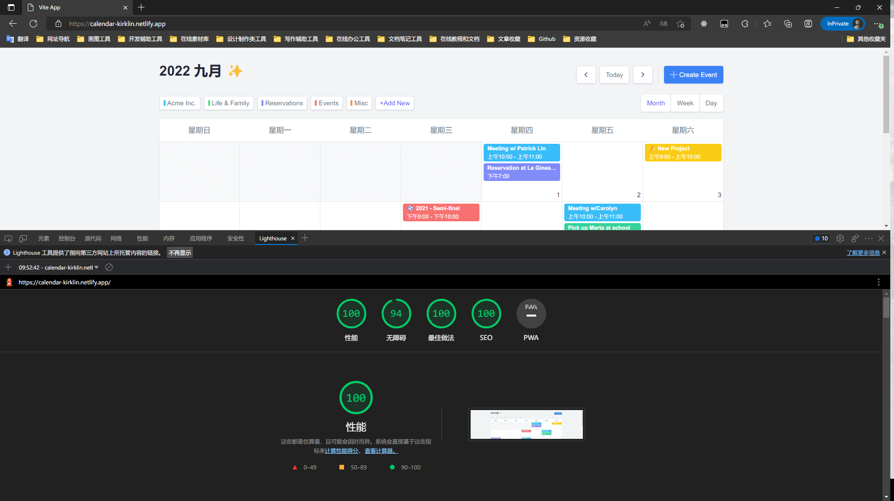

<div align='center'>
<h1>Calendar</h1>
</div>

<p align='center'>
🍞📅 A Vue calendar Component
</p>

<div align='center'>
<b>English</b> | <a href="README.zh-CN.md">简体中文</a>
</div>

## Features

- ⚡  [Vue 3](https://github.com/vuejs/vue-next), [Vite 2](https://github.com/vitejs/vite), [pnpm](https://pnpm.js.org/) - born with fastness
- 💪 [Typescript](https://www.typescriptlang.org/) - of course! necessary
- 🔥 Use the [new `<script setup>` syntax](https://github.com/vuejs/rfcs/pull/227)
- 🎨 [Tailwind CSS v3](https://tailwindcss.com/docs/configuration) - Rapidly build modern websites without ever leaving your HTML.

### Coding Style

- [@kirklin/eslint-config](https://github.com/kirklin/eslint-config)

### Recommended IDE Setup

- [VSCode](https://code.visualstudio.com/)
- [Volar](https://marketplace.visualstudio.com/items?itemName=johnsoncodehk.volar)


## ✨ Monthly, Weekly, Daily View 


### Performance



## Try it now!

### Clone to local

```bash
npx degit kirklin/calendar my-vite-app
cd my-vite-app
pnpm i
```

## Usage

### Development

Just run and visit http://localhost:8888

```bash
pnpm run dev
```

### Build

To build the App, run

```bash
pnpm run build
```

And you will see the generated file in `dist` that ready to be served.
