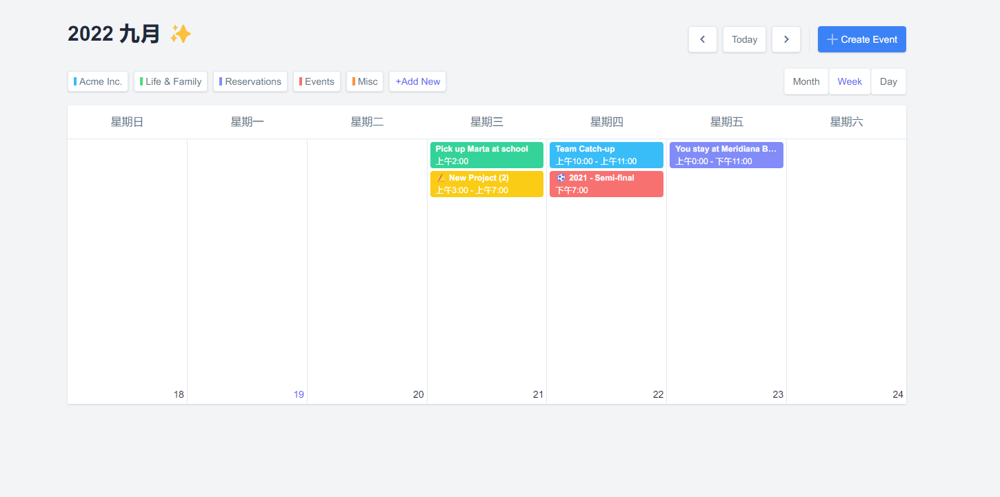

<div align='center'>
<h1>Calendar </h1>
</div>

<p align='center'>
🍞📅  基于 vue 3.0,unocss 开发的日历组件
</p>

## 特性

- ⚡  [Vue 3](https://github.com/vuejs/vue-next), [Vite 2](https://github.com/vitejs/vite), [pnpm](https://pnpm.js.org/) - 为速度而生
- 💪 [Typescript](https://www.typescriptlang.org/) - 强大的类型检查
- 🔥 使用 [新的 `<script setup>` 语法](https://github.com/vuejs/rfcs/pull/227)
- 💡 [Vue Router v4](https://router.vuejs.org/zh/) - Vue 路由系统
- 🎨 [UnoCSS](https://unocss.dev/) - The instant on-demand atomic CSS engine, providing a lightweight and fast way to style your app.

### 编码风格

- [@kirklin/eslint-config](https://github.com/kirklin/eslint-config)

### 推荐的 IDE 设置

- [VSCode](https://code.visualstudio.com/)
- [Volar](https://marketplace.visualstudio.com/items?itemName=johnsoncodehk.volar)

## ✨ 效果图（月视图、周视图）



### 性能


## 快来试试吧！！

### 克隆到本地

```bash
npx degit kirklin/calendar my-vite-app
cd my-vite-app
pnpm i
```

## 使用

### 开发

只需要执行以下命令就可以在 http://localhost:8888 中看到

```bash
pnpm run dev
```

### 构建

构建该应用只需要执行以下命令

```bash
pnpm run build
```

然后你会看到用于发布的 `dist` 文件夹被生成。
